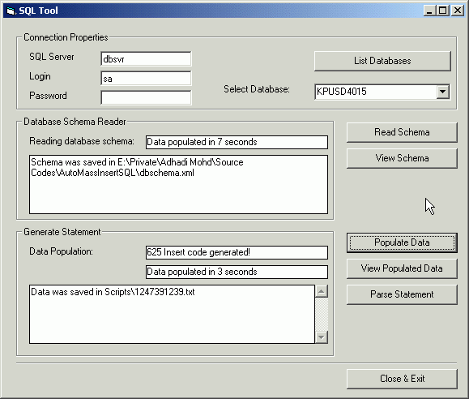



## Automated SQL Mass Insert Statement / Database Schema to XML Generator

### Description

The reason of doing is because I need to install my application together with database (schema & lookup data) at the client site.

Of course we can do this using different approach like BACKUP/RESTORE, or MS Access upsizing. In my case, I need to script all the schema and the lookup data to have a better control to the setup file.

Download VB6x LIbrary before using this program.

http://www.geocities.com/adhadi/HadiLIb.zip
 
### More Info
 
SQL 2000 or MSDE2000 was installed.

Returned schema for 100+ tables in 17 seconds.

Returned 30000+ insert statement (with text datatype) in 100 seconds.

(Medium sized development server)

             |
---                |---
**Submitted On**   |2002-11-25 12:44:46
**By**             |[Adhadi Mohd](https://github.com/Planet-Source-Code/PSCIndex/blob/master/ByAuthor/adhadi-mohd.md)
**Level**          |Intermediate
**User Rating**    |4.0 (16 globes from 4 users)
**Compatibility**  |VB 6\.0
**Category**       |[Databases/ Data Access/ DAO/ ADO](https://github.com/Planet-Source-Code/PSCIndex/blob/master/ByCategory/databases-data-access-dao-ado__1-6.md)
**World**          |[Visual Basic](https://github.com/Planet-Source-Code/PSCIndex/blob/master/ByWorld/visual-basic.md)
**Archive File**   |[Automated\_15035111252002\.zip](https://github.com/Planet-Source-Code/adhadi-mohd-automated-sql-mass-insert-statement-database-schema-to-xml-generator__1-41029/archive/master.zip)

